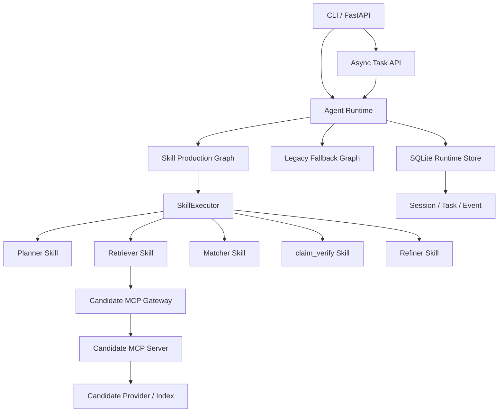

# Recruit-Graph

基于 Skill 与 Runtime 的智能招聘匹配系统。

输入招聘 JD，系统自动解析岗位需求、检索候选人、生成匹配评分与推荐依据，并通过持久化 Runtime 记录任务状态和执行事件。项目面向本地简历筛选、技术招聘匹配实验，以及 Skill-based Agent Runtime / FastAPI Runtime Service 架构展示。

## 项目简介

Recruit-Graph 将招聘匹配流程拆分为可执行、可观测、可回退的 Skill：

```text
JD -> Planner -> Retriever -> CandidateProfilePreview -> Matcher -> claim_verify -> Refiner
```

当前默认主链路是 Skill Production Graph。Legacy Graph 仍保留为兼容基线和硬故障回滚路径，便于对比与回退。

## 核心功能

- 招聘 JD 解析与结构化岗位要求提取
- 本地 PDF 简历解析、索引与候选人检索
- CandidateProfilePreview v2 候选人档案构建
- 候选人匹配评分、排序与推荐依据生成
- Planner、Retriever、Matcher、Refiner Skill
- SkillExecutor 驱动的默认生产主链路
- `claim_verify@1.0.0` 跨 Matcher / Resume Rewrite 复用
- Candidate MCP Server：`search_candidates`、`get_candidate_profile`、`get_resume_evidence` 三个只读工具
- FastAPI Runtime Service：异步任务、事件查询、SSE、反馈、Review Queue、取消
- Human Feedback Review Loop：人工决策、correction overlay、Memory Candidate 审批
- Governed Memory：active / revoked / expired / superseded 状态与显式 `memory_mode=governed`
- Session、Task、Thread、Event Runtime
- SQLite 任务状态与事件日志持久化
- Skill 硬故障时回退 Legacy Graph
- Retriever 与 Matcher 离线评估
- JD 伪装简历、Prompt Injection 等安全测试

## 系统架构



Runtime 是统一执行入口，负责 Session、Task、Thread 和事件生命周期；默认由 Skill Production Graph 执行招聘匹配，Legacy Graph 仅作为兼容基线和硬故障回滚路径。FastAPI 层只负责租户、幂等、队列、任务查询、事件流和人工复核，不直接调用 Agent。Candidate MCP Server 目前采用本地 stdio transport，提供 summary-only 的只读候选人数据访问。Governed Memory 默认关闭，只有请求显式设置 `memory_mode=governed` 时才会构建只读 MemoryContext。

## 使用方式

### 环境准备

```bash
conda env create -f environment.yml
conda activate recruit-graph
cp .env.example .env
```

在本地 `.env` 中填写模型服务和缓存路径。不要提交 `.env`。

### 准备本地简历

将 PDF 简历放入本地私有数据目录。简历、向量索引和运行数据库均不会提交到公开仓库。

```bash
python scripts/build_resume_index.py \
  --pdf-dir data \
  --persist-dir chroma_db
```

不写入索引的 dry-run：

```bash
python scripts/build_resume_index.py \
  --pdf-dir data \
  --persist-dir chroma_db \
  --dry-run \
  --json
```

### 输入 JD 并运行匹配

```bash
python scripts/run_recruit_runtime.py \
  --jd "招聘熟悉 Python、RAG 和 LangGraph 的 AI Agent 工程师" \
  --json
```

### 使用 Candidate MCP 数据源

启动本地只读 Candidate MCP Server：

```bash
python scripts/run_candidate_mcp_server.py \
  --dataset-dir evaluation_data/v1
```

通过默认 Skill Production Graph 使用 MCP 候选人数据源：

```bash
python scripts/run_recruit_runtime.py \
  --candidate-source mcp \
  --jd "招聘熟悉 Python、RAG 和 LangGraph 的 AI Agent 工程师" \
  --json
```

MCP 模式使用 synthetic/anonymized evaluation dataset 作为公开示例数据源。生产或私有简历数据应保存在本地私有目录，并通过受控 provider 接入。

### 启动 FastAPI Runtime Service

```bash
python scripts/run_api_server.py \
  --host 127.0.0.1 \
  --port 8765
```

创建异步匹配任务：

```bash
curl -X POST "http://127.0.0.1:8765/matching/tasks" \
  -H "Content-Type: application/json" \
  -H "X-Tenant-ID: demo_tenant" \
  -H "Idempotency-Key: demo-task-001" \
  -d '{
    "jd_text": "招聘熟悉 Python、RAG 和 LangGraph 的 AI Agent 工程师",
    "candidate_source": "mcp"
  }'
```

查询任务和事件：

```bash
curl -H "X-Tenant-ID: demo_tenant" \
  "http://127.0.0.1:8765/tasks/<task_id>"

curl -H "X-Tenant-ID: demo_tenant" \
  "http://127.0.0.1:8765/tasks/<task_id>/events"

curl -N -H "X-Tenant-ID: demo_tenant" \
  "http://127.0.0.1:8765/tasks/<task_id>/stream"
```

API 当前提供 `POST /matching/tasks`、`GET /tasks/{task_id}`、`GET /tasks/{task_id}/events`、`GET /tasks/{task_id}/stream`、`POST /tasks/{task_id}/feedback`、`GET /tasks/{task_id}/feedback`、`POST /tasks/{task_id}/cancel`。第一版使用进程内有界 worker queue；PostgreSQL、Redis、Celery 和完整认证属于后续计划。

### Human Feedback、Review 与 Governed Memory

提交人工反馈：

```bash
curl -X POST "http://127.0.0.1:8765/tasks/<task_id>/feedback" \
  -H "Content-Type: application/json" \
  -H "X-Tenant-ID: demo_tenant" \
  -d '{
    "feedback_type": "evidence_missing",
    "candidate_id": "<candidate_id>",
    "comment": "候选人缺少已发表论文证据",
    "request_review": true
  }'
```

带 `request_review=true` 的 reject / correction / evidence_missing 等反馈会进入 Review Queue。人工决策不会覆盖原始 MatchReport，而是保存 review status 和 correction overlay：

```bash
curl -X POST "http://127.0.0.1:8765/reviews/<review_id>/decision" \
  -H "Content-Type: application/json" \
  -H "X-Tenant-ID: demo_tenant" \
  -d '{
    "decision": "correct",
    "correction": {"publication_status": "under_review"},
    "promote_to_memory": true,
    "memory_candidate_type": "matching_rule"
  }'
```

只有显式 `promote_to_memory=true` 且经过 Memory Candidate 审批后，反馈才会成为 governed active memory：

```bash
curl -X POST "http://127.0.0.1:8765/memory-candidates/<memory_candidate_id>/approve" \
  -H "X-Tenant-ID: demo_tenant"
```

后续任务必须显式开启 governed memory：

```bash
curl -X POST "http://127.0.0.1:8765/matching/tasks" \
  -H "Content-Type: application/json" \
  -H "X-Tenant-ID: demo_tenant" \
  -H "Idempotency-Key: demo-task-with-memory-001" \
  -d '{
    "jd_text": "招聘熟悉 Python、RAG 和 LangGraph 的 AI Agent 工程师",
    "candidate_source": "mcp",
    "memory_mode": "governed"
  }'
```

Memory 支持 revoke / expire / supersede。被撤销或过期的 Memory 不会进入后续任务的 MemoryContext。当前实现是 post-result review，不支持 Graph 中途 interrupt / checkpoint resume。

### 上传候选人简历版本

创建候选人：

```bash
curl -X POST "http://127.0.0.1:8765/candidates" \
  -H "Content-Type: application/json" \
  -H "X-Tenant-ID: demo_tenant" \
  -H "Idempotency-Key: candidate-001" \
  -d '{"external_ref": "optional-demo-ref"}'
```

上传不可变 ResumeVersion：

```bash
curl -X POST "http://127.0.0.1:8765/candidates/<candidate_id>/resume-versions" \
  -H "X-Tenant-ID: demo_tenant" \
  -H "Idempotency-Key: resume-version-001" \
  -F "file=@./local_private_resume.txt;type=text/plain"
```

上传接口支持 PDF、DOCX、TXT。服务端按内容计算 SHA-256，同一 tenant / candidate 下重复上传相同内容会返回已有 `resume_version_id`，不会重复解析和索引；不同内容会创建新的不可变版本，只有解析、证据生成和候选人级索引全部成功后才切换为 active version。

查询候选人画像：

```bash
curl -H "X-Tenant-ID: demo_tenant" \
  "http://127.0.0.1:8765/candidates/<candidate_id>/profile"
```

候选人摄取同样走 Runtime task、SkillExecutor 和事件流，内部使用 `resume_parse@1.0.0` 与 `evidence_extract@1.0.0` 生成 CandidateProfilePreview v2 与 ResumeEvidence。上传后的 active candidate 可以通过 Candidate MCP 被 `candidate_source=mcp` 匹配任务检索到。

### 查看任务事件

```bash
python scripts/inspect_runtime_task.py \
  --db-path storage/sqlite/recruit_runtime.sqlite \
  --latest \
  --events \
  --json
```

更多参数请运行：

```bash
python scripts/build_resume_index.py --help
python scripts/run_recruit_runtime.py --help
python scripts/inspect_runtime_task.py --help
```

## 评估结果

| 模块                   | 指标                        |          结果 |
| ---------------------- | --------------------------- | ------------: |
| Retriever              | MRR                         |         0.958 |
| Retriever              | Recall@10                   |   0.675-0.722 |
| Retriever              | nDCG@10                     |   0.801-0.814 |
| Matcher + Preview v2   | Spearman                    |         0.588 |
| Matcher + Preview v2   | Pairwise Accuracy           |         0.826 |
| Matcher + Preview v2   | nDCG@5                      |         0.852 |
| Matcher                | Structured Output Success   |          100% |

以上指标基于 synthetic/anonymized 技术招聘评估集。真实简历、生成结果和本地索引不会提交到公开仓库。

## 项目结构

```text
src/
  core/          Graph 与统一 GraphFactory
  runtime/       Session / Task / Event Runtime
  skills/        Skill Registry、Executor 与业务 Skill
  agents/        Planner / Retriever / Matcher / Refiner
  services/      简历检索服务
  evaluation/    Retriever 与 Matcher 评估
  memory/        Memory 基础设施
  tools/         Tool 与 MCP 接入基础
  mcp/           Candidate MCP Server / Client / Gateway

scripts/         索引、运行和检查脚本
tests/           单元测试与集成测试
config/          运行和评估配置
docs/            对外架构、评估和路线说明
```

## 当前状态与后续计划

- [x] Skill-based production graph
- [x] Runtime task and event persistence
- [x] Candidate retrieval and ranking
- [x] CandidateProfilePreview v2
- [x] Legacy hard-failure fallback
- [x] Retrieval and Matcher evaluation
- [x] Observation-only Claim Verification Skill
- [x] Candidate MCP server with three read-only tools
- [x] FastAPI Runtime Service MVP
- [x] Candidate creation and immutable ResumeVersion upload
- [x] Human Feedback Review Loop and correction overlay
- [x] Governed Memory explicit injection and revoke
- [ ] Durable async queue and production database
- [ ] FastAPI resume upload UI
- [ ] Production observability

当前可用：

- 本地简历导入与索引
- CLI 输入招聘 JD
- 候选人检索、匹配与排序
- Runtime 任务和事件持久化
- Legacy 硬故障回滚
- Candidate MCP stdio server 和只读工具访问
- FastAPI 异步任务、事件查询、SSE、反馈与取消
- Candidate 创建、content-hash 幂等上传、不可变 ResumeVersion
- `resume_parse` / `evidence_extract` 摄取 Skill
- Human Feedback → Review Item → Human Decision
- Memory Candidate 审批与 governed active memory
- 显式 `memory_mode=governed` 的只读 MemoryContext 注入
- 离线评估与安全测试

Coming Soon：

- PostgreSQL / Redis
- durable async queue / task ownership
- object storage adapter / virus scan / OCR
- OpenTelemetry 与监控面板

## 数据与隐私说明

公开仓库不会包含：

- `.env`
- 真实简历
- 本地上传文件
- Chroma 向量索引
- Runtime SQLite 数据库
- 生成的评估结果
- API key / token

仓库内的 `evaluation_data/v1` 是 synthetic/anonymized 技术招聘评估集，使用 `candidate_001` 这类稳定 ID，不包含真实个人信息。

Candidate MCP Server 默认只暴露三个只读工具，并包含 allowlist、参数校验、timeout、调用预算、tenant/access scope contract 和 summary-only Runtime events。简历中的 Prompt Injection 文本只会被当作候选人数据处理，不会改变工具权限或扩大返回字段。

FastAPI Runtime Service 要求业务接口携带 `X-Tenant-ID`，创建任务建议提供 `Idempotency-Key`。当前多租户能力是 MVP 级隔离 contract：任务、事件、反馈和取消按 tenant 校验；完整认证、授权、速率限制和分布式任务队列仍在 roadmap。

候选人上传文件保存在本地 `storage/` 下，该目录被 `.gitignore` 排除。当前版本不会执行上传文件中的脚本或宏，不支持 OCR，也不声称具备病毒扫描或对象存储能力；这些属于后续生产化工作。

Human Feedback 和 Memory API 只返回 summary-safe 字段。完整评论、完整 Matcher reasoning、完整 Memory 内容不会写入 Runtime event。反馈不会自动进入 Memory；必须经过人工 Review Decision 和 Memory Candidate 审批。Memory 默认不会注入任务，必须显式设置 `memory_mode=governed`。

## License

暂未指定开源许可证。如需使用或二次开发，请先联系项目作者。
