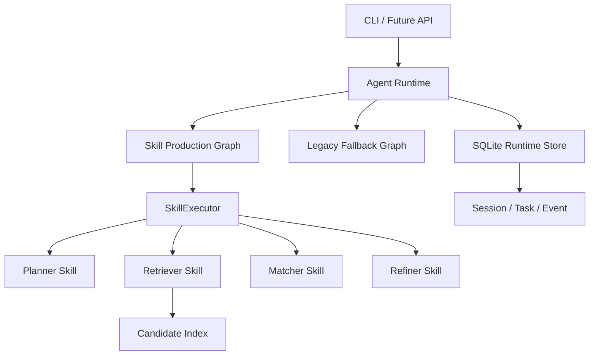

# Recruit-Graph

基于 Skill 与 Runtime 的智能招聘匹配系统。

输入招聘 JD，系统自动解析岗位需求、检索候选人、生成匹配评分与推荐依据，并通过持久化 Runtime 记录任务状态和执行事件。项目面向本地简历筛选、技术招聘匹配实验，以及 Skill-based Agent Runtime 架构展示。

## 项目简介

Recruit-Graph 将招聘匹配流程拆分为可执行、可观测、可回退的 Skill：

```text
JD -> Planner -> Retriever -> CandidateProfilePreview -> Matcher -> Refiner
```

当前默认主链路是 Skill Production Graph。Legacy Graph 仍保留为兼容基线和硬故障回滚路径，便于对比与回退。

## 核心功能

- 招聘 JD 解析与结构化岗位要求提取
- 本地 PDF 简历解析、索引与候选人检索
- CandidateProfilePreview v2 候选人档案构建
- 候选人匹配评分、排序与推荐依据生成
- Planner、Retriever、Matcher、Refiner Skill
- SkillExecutor 驱动的默认生产主链路
- Session、Task、Thread、Event Runtime
- SQLite 任务状态与事件日志持久化
- Skill 硬故障时回退 Legacy Graph
- Retriever 与 Matcher 离线评估
- JD 伪装简历、Prompt Injection 等安全测试

## 系统架构



Runtime 是统一执行入口，负责 Session、Task、Thread 和事件生命周期；默认由 Skill Production Graph 执行招聘匹配，Legacy Graph 仅作为兼容基线和硬故障回滚路径。

## 使用方式

### 环境准备

```bash
conda env create -f environment.yml
conda activate recruit-graph
cp .env.example .env
```

在本地 `.env` 中填写模型服务和缓存路径。不要提交 `.env`。

### 准备本地简历

将 PDF 简历放入本地私有数据目录。简历、向量索引和运行数据库均不会提交到公开仓库。

```bash
python scripts/build_resume_index.py \
  --pdf-dir data \
  --persist-dir chroma_db
```

不写入索引的 dry-run：

```bash
python scripts/build_resume_index.py \
  --pdf-dir data \
  --persist-dir chroma_db \
  --dry-run \
  --json
```

### 输入 JD 并运行匹配

```bash
python scripts/run_recruit_runtime.py \
  --jd "招聘熟悉 Python、RAG 和 LangGraph 的 AI Agent 工程师" \
  --json
```

### 查看任务事件

```bash
python scripts/inspect_runtime_task.py \
  --db-path storage/sqlite/recruit_runtime.sqlite \
  --latest \
  --events \
  --json
```

更多参数请运行：

```bash
python scripts/build_resume_index.py --help
python scripts/run_recruit_runtime.py --help
python scripts/inspect_runtime_task.py --help
```

## 评估结果

| 模块                   | 指标                        |          结果 |
| ---------------------- | --------------------------- | ------------: |
| Retriever              | MRR                         |         0.958 |
| Retriever              | Recall@10                   |   0.675-0.722 |
| Retriever              | nDCG@10                     |   0.801-0.814 |
| Matcher + Preview v2   | Spearman                    |         0.588 |
| Matcher + Preview v2   | Pairwise Accuracy           |         0.826 |
| Matcher + Preview v2   | nDCG@5                      |         0.852 |
| Matcher                | Structured Output Success   |          100% |

以上指标基于 synthetic/anonymized 技术招聘评估集。真实简历、生成结果和本地索引不会提交到公开仓库。

## 项目结构

```text
src/
  core/          Graph 与统一 GraphFactory
  runtime/       Session / Task / Event Runtime
  skills/        Skill Registry、Executor 与业务 Skill
  agents/        Planner / Retriever / Matcher / Refiner
  services/      简历检索服务
  evaluation/    Retriever 与 Matcher 评估
  memory/        Memory 基础设施
  tools/         Tool 与 MCP 接入基础

scripts/         索引、运行和检查脚本
tests/           单元测试与集成测试
config/          运行和评估配置
docs/            对外架构、评估和路线说明
```

## 当前状态与后续计划

- [x] Skill-based production graph
- [x] Runtime task and event persistence
- [x] Candidate retrieval and ranking
- [x] CandidateProfilePreview v2
- [x] Legacy hard-failure fallback
- [x] Retrieval and Matcher evaluation
- [x] Observation-only Claim Verification Skill
- [ ] Candidate MCP server
- [ ] FastAPI resume upload and asynchronous tasks
- [ ] Production observability

当前可用：

- 本地简历导入与索引
- CLI 输入招聘 JD
- 候选人检索、匹配与排序
- Runtime 任务和事件持久化
- Legacy 硬故障回滚
- 离线评估与安全测试

Coming Soon：

- Candidate MCP Server
- FastAPI 简历上传与匹配接口
- 异步任务与 SSE 事件流
- PostgreSQL / Redis
- OpenTelemetry 与监控面板

## 数据与隐私说明

公开仓库不会包含：

- `.env`
- 真实简历
- 本地上传文件
- Chroma 向量索引
- Runtime SQLite 数据库
- 生成的评估结果
- API key / token

仓库内的 `evaluation_data/v1` 是 synthetic/anonymized 技术招聘评估集，使用 `candidate_001` 这类稳定 ID，不包含真实个人信息。

## License

暂未指定开源许可证。如需使用或二次开发，请先联系项目作者。
